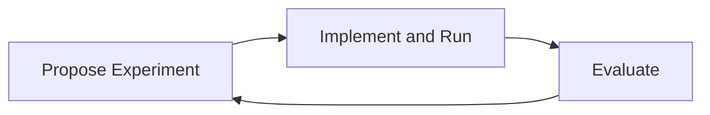

# Common Cycle in Many Disciplines

## The universal loop of science and engineering

## Our approach: automate the loop

- Drive down iteration time.
- Propose and automatically run many experiments.
- Learn from each evaluation to produce better experiments.
- Scale the quality and volume of experiments toward breakthrough results.

This cycle is one important research pattern. Open Discovery should support it wherever it fits while allowing researchers in other disciplines to define the methods and standards appropriate to their own questions.
